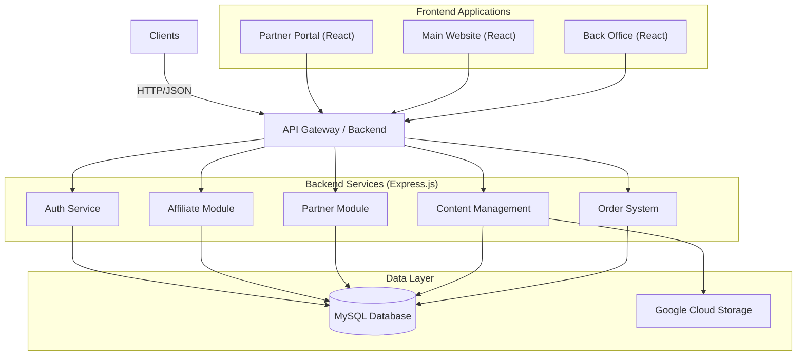

# Octobees Revamp 2025

> A modern, scalable, and comprehensive web platform for Octobees, featuring a robust Partner Portal, Affiliate System, and Content Management System. Built with performance, security, and scalability in mind.

[](https://nodejs.org/)
[](https://reactjs.org/)
[](https://www.typescriptlang.org/)
[](https://expressjs.com/)
[](https://www.mysql.com/)
[](https://orm.drizzle.team/)

## 📋 Table of Contents

- [Overview](#-overview)
- [System Architecture](#-system-architecture)
- [Project Structure](#-project-structure)
- [Key Features & Modules](#-key-features--modules)
  - [Partner Portal](#partner-portal)
  - [Affiliate System](#affiliate-system)
  - [Back Office](#back-office)
  - [Public Website](#public-website)
- [Getting Started](#-getting-started)
  - [Prerequisites](#prerequisites)
  - [Installation](#installation)
  - [Environment Configuration](#environment-configuration)
- [API Documentation](#-api-documentation)
- [Database Schema](#-database-schema)
- [Testing](#-testing)
- [Deployment](#-deployment)
- [Development Workflow](#-development-workflow)
- [Contributing](#-contributing)
    *   **Main Website**: (In Progress) The public-facing corporate site.
    *   **Back Office**: (In Progress) The administrative command center.

---

## 🏗️ System Architecture

The system follows a modular, service-oriented architecture pattern.



---

## 📂 Project Structure

The repository is organized as a monorepo for easier management and code sharing context.

```
octobees_revamp-2025/
├── api-backend/              # 🧠 The Brain: Backend API
│   ├── drizzle/              # Database Configuration
│   │   ├── migrations/       # SQL Migration files
│   │   ├── db.js             # Database connection
│   │   └── schema.js         # Drizzle schema definitions
│   ├── src/
│   │   ├── affiliate/        # Affiliate system logic
│   │   ├── auth/             # Authentication & Authorization
│   │   ├── blog/             # Blog management
│   │   ├── career/           # Recruitment system
│   │   ├── order/            # Order processing
│   │   ├── partner/          # Partner portal logic
│   │   ├── seeder/           # Database seeders
│   │   ├── user/             # User management
│   │   ├── middleware/       # Custom middlewares
│   │   ├── routes.js         # Main route definitions
│   │   └── index.js          # Entry point
│   ├── .env.example          # Backend env template
│   └── package.json
│
├── back-office/              # 🏢 The Command Center: Admin Panel
│   ├── src/                  # Next.js App Router source
│   ├── public/               # Static assets
│   ├── .env.example          # Environment template
│   └── package.json
│
├── end-user/                 # 🌐 The Face: Main Website
│   ├── src/                  # Next.js App Router source
│   ├── public/               # Static assets
│   ├── .env.example          # Environment template
│   └── package.json
│
├── partner/                  # 🤝 The Bridge: Partner Portal Frontend
│   ├── src/
│   │   ├── app/              # Next.js App Router
│   │   │   ├── (auth)/       # Authentication routes
│   │   │   ├── (pages)/      # Main application routes
│   │   │   ├── layout.tsx    # Root layout
│   │   │   └── page.tsx      # Home page
│   │   ├── components/       # Reusable UI Components
│   │   ├── hooks/            # Custom React Hooks
│   │   ├── data/             # Static data & constants
│   │   └── lib/              # Utilities & API Clients
│   ├── .env.example          # Frontend env template
│   └── package.json
│
└── README.md                 # This documentation
```

---

## 🌟 Key Features & Modules

### 🤝 Partner Portal
*Designed for business partners to grow with Octobees.*

-   **Dashboard Analytics**: Real-time visualization of performance, pending commissions, and conversion rates.
-   **Lead Management**: Complete lifecycle management of leads (Create -> Follow-up -> Closed).
-   **Service Catalog**: Browse available Octobees services with transparent commission rates.
-   **Commission Tracking**: Detailed history of earnings, payouts, and pending balances.
-   **Profile Management**: Self-service profile and security settings.

### 🎁 Affiliate System
*Empowering brand ambassadors.*

-   **Referral Tracking**: Advanced tracking of clicks, signups, and conversions via unique referral links.
-   **Application Workflow**: Streamlined process for new affiliates to apply and get approved.
-   **Automated Commissions**: Smart calculation engine for referral rewards.

### 🏢 Back Office
*The command center for administrators.*

-   **Resource Management**: CRUD capabilities for all system entities (Users, Blogs, Services).
-   **User Management**: Role-based access control (RBAC) for admin staff.
-   **Affiliate Approval**: Workflow to review and approve/reject affiliate applications.
-   **Global Analytics**: System-wide statistics and data export (CSV/Excel).

### 🌐 Public Website
*The customer-facing experience.*

-   **Blog System**: SEO-optimized content delivery.
-   **Career Portal**: Job listings and application submission.
-   **Service Showcase**: Detailed presentation of services and pricing plans.
-   **Order System**: Seamless checkout and inquiry process.

---

## 🚀 Getting Started

Follow these steps to set up the development environment.

### Prerequisites

-   **Node.js**: v20.x or higher (LTS recommended)
-   **MySQL**: v8.x
-   **Package Manager**: npm or yarn
-   **Git**: For version control

### Installation

1.  **Clone the repository**
    ```bash
    git clone https://github.com/SSDIGITAL-DevTeam/octobees_revamp-2025.git
    cd octobees_revamp-2025
    ```

2.  **Backend Setup**
    ```bash
    cd api-backend
    npm install
    
    # Configure Environment
    cp .env.example .env
    # Open .env and update DB_HOST, DB_USER, DB_PASSWORD, etc.
    
    # Database Setup
    npm run push          # Apply database migrations
    npm run seed          # (Optional) Seed initial data
    
    # Start Server
    npm run dev
    ```
    *Server will start at `http://localhost:8080`*

3.  **Partner Portal Setup**
    ```bash
    cd ../partner
    npm install
    
    # Configure Environment
    cp .env.example .env
    # Ensure VITE_API_URL points to your backend (e.g., http://localhost:8080/api)
    
    # Start Client
    npm run dev
    ```
    *Client will start at `http://localhost:5173`*

### Environment Configuration

**Backend (`api-backend/.env`)**
| Variable | Description | Example |
|----------|-------------|---------|
| `PORT` | Server port | `8080` |
| `DB_HOST` | MySQL Host | `localhost` |
| `DB_USER` | MySQL User | `root` |
| `DB_NAME` | Database Name | `octobees` |
| `JWT_SECRET` | Secret for tokens | `super_secret_key` |

**Frontend (`partner/.env`)**
| Variable | Description | Example |
|----------|-------------|---------|
| `VITE_API_URL` | API Base URL | `http://localhost:8080/api` |

---

## 📚 API Documentation

The backend provides a comprehensive Swagger-like experience via Postman Collections.

-   **Base URL**: `http://localhost:8080/api/v1`
-   **Authentication**: Bearer Token (JWT)

To view the schema visually:
```bash
cd api-backend
npm run studio
```

---

## 🧪 Testing

We emphasize quality through comprehensive testing.

### Backend Tests
```bash
cd api-backend
npm test                              # Run unit & integration tests
node src/seeder/create-test-data.js   # Generate mock data for manual testing
```

**Test Accounts:**
-   **Partner**: `testpartner@example.com` / `password123`
-   **Admin**: `admin@octobees.com` / `password123`

---

## 🚀 Deployment

### Backend
The backend is production-ready and can be deployed using PM2 or Docker.

```bash
cd api-backend
npm ci --production
npm run push              # Ensure DB is up to date
pm2 start src/index.js --name octobees-api
```

### Frontend
The frontend is built using Vite and can be deployed to any static host (Vercel, Netlify, Nginx).

```bash
cd partner
npm run build
# The 'dist' folder is ready for deployment
```

---

## 🤝 Contributing

We welcome contributions from the team!

1.  **Branching**: Use `feature/feature-name` or `fix/bug-name`.
2.  **Commits**: Follow Conventional Commits (e.g., `feat: add new dashboard widget`).
3.  **Pull Requests**: Open a PR to `main` for review.

---

## 📄 License

Copyright © 2025 Octobees. All rights reserved.

---

**Built with ❤️ by the Octobees Development Team**
