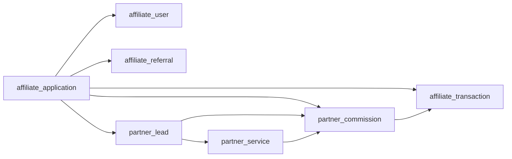

# Octobees API Backend

> Complete backend API for Octobees website and partner portal, built with Express.js, Drizzle ORM, and MySQL.

[](https://nodejs.org/)
[](https://expressjs.com/)
[](https://orm.drizzle.team/)
[](https://www.mysql.com/)

## 📋 Table of Contents

- [Overview](#overview)
- [Features](#features)
- [Tech Stack](#tech-stack)
- [Project Structure](#project-structure)
- [Getting Started](#getting-started)
- [API Documentation](#api-documentation)
- [Database Schema](#database-schema)
- [Testing](#testing)
- [Deployment](#deployment)
- [Contributing](#contributing)

---

## 🎯 Overview

Octobees API Backend adalah RESTful API yang menyediakan layanan untuk:
- **Website Octobees**: Blog, career, services, orders, subscriptions
- **Partner Portal**: Lead management, commission tracking, dashboard analytics
- **Affiliate System**: Referral tracking, commission management
- **Back Office**: Admin panel untuk mengelola semua resources

API ini dibangun dengan arsitektur modular yang scalable dan maintainable, menggunakan best practices dalam Node.js development.

---

## ✨ Features

### 🌐 Public API
- **Blog Management**: CRUD operations dengan image upload
- **Career Applications**: Job posting dan application management
- **Service Catalog**: Service categories dan pricing plans
- **Order System**: Customer order processing
- **Newsletter**: Email subscription management
- **SEO**: Meta tags dan page management

### 🤝 Affiliate System
- **Application Management**: Submit dan approve affiliate applications
- **Dashboard**: Real-time stats, transactions, referrals
- **Commission Tracking**: Automated commission calculation
- **Referral System**: Track clicks, signups, conversions

### 🎯 Partner Portal
- **Lead Management**: Full CRUD untuk partner leads
- **Service Catalog**: Available services dengan commission rates
- **Commission History**: Detailed commission tracking dengan pagination
- **Dashboard Analytics**: Stats, recent leads, pending commissions
- **Profile Management**: Update profile dan change email

### 🏢 Back Office
- **Resource Management**: Admin CRUD untuk semua resources
- **Affiliate Approval**: Approve/reject affiliate applications
- **Statistics**: Application stats dan export CSV
- **User Management**: Admin user management

---

## 🛠️ Tech Stack

### Core
- **Runtime**: Node.js 20.x
- **Framework**: Express.js 4.x
- **Language**: JavaScript (ES Modules)
- **Database**: MySQL 8.x
- **ORM**: Drizzle ORM 0.40

### Libraries & Tools
- **Authentication**: JWT (jsonwebtoken)
- **Password Hashing**: bcryptjs
- **File Upload**: Multer
- **Validation**: Zod
- **Rate Limiting**: express-rate-limit
- **Security**: Helmet, CORS
- **Logging**: Pino
- **Email**: Nodemailer
- **Cloud Storage**: Google Cloud Storage

### Development
- **Migration Tool**: Drizzle Kit
- **Testing**: Jest, Supertest
- **Process Manager**: Nodemon
- **API Testing**: Postman (collections included)

---

## 📁 Project Structure

```
api-backend/
├── drizzle/                    # Database schema & migrations
│   ├── db.js                  # Database connection
│   ├── schema.js              # Drizzle schema definitions
│   └── migrations/            # Migration files
│
├── src/
│   ├── affiliate/             # Affiliate module
│   │   ├── affiliate.auth.controller.js
│   │   ├── affiliate.dashboard.controller.js
│   │   ├── affiliate.repository.js
│   │   ├── affiliate.service.js
│   │   └── _affiliate.route.js
│   │
│   ├── partner/               # Partner Portal module
│   │   ├── partner.repository.js
│   │   ├── partner.service.js
│   │   ├── partner.leads.controller.js
│   │   ├── partner.dashboard.controller.js
│   │   ├── partner.profile.controller.js
│   │   └── _partner.route.js
│   │
│   ├── blog/                  # Blog module
│   ├── career/                # Career module
│   ├── order/                 # Order module
│   ├── user/                  # User module
│   ├── service-plan/          # Service plan module
│   ├── service-category/      # Service category module
│   ├── page/                  # Page module
│   ├── meta/                  # Meta tags module
│   ├── subscription/          # Subscription module
│   ├── position/              # Position module
│   ├── blog-category/         # Blog category module
│   │
│   ├── auth/                  # Authentication
│   │   ├── login/
│   │   ├── logout/
│   │   ├── refresh-token/
│   │   ├── forgot-password/
│   │   └── reset-password/
│   │
│   ├── middleware/            # Custom middleware
│   │   ├── uploadFile.js
│   │   └── verify.token.js
│   │
│   ├── seeder/                # Database seeders
│   │   ├── seeder.js
│   │   ├── partner.seeder.js
│   │   └── create-test-data.js
│   │
│   ├── routes.js              # Main router
│   └── index.js               # App entry point
│
├── utils/                     # Utilities
│   └── logger.js              # Pino logger
│
├── upload/                    # File uploads directory
├── .env                       # Environment variables
├── .env.example               # Environment template
├── drizzle.config.js          # Drizzle configuration
├── package.json               # Dependencies
├── server.cjs                 # Server entry (for Passenger)
│
└── Postman Collections/       # API testing
    ├── Octobees-API-Complete.postman_collection.json
    ├── Partner-Portal-API.postman_collection.json
    └── POSTMAN_GUIDE.md
```

---

## 🚀 Getting Started

### Prerequisites

- Node.js 20.x or higher
- MySQL 8.x
- npm or yarn

### Installation

1. **Clone the repository**
   ```bash
   git clone https://github.com/SSDIGITAL-DevTeam/octobees_revamp-2025.git
   cd octobees_revamp-2025/api-backend
   ```

2. **Install dependencies**
   ```bash
   npm install
   ```

3. **Setup environment variables**
   ```bash
   cp .env.example .env
   ```
   
   Edit `.env` and configure:
   ```env
   # Database
   DB_HOST=localhost
   DB_PORT=3306
   DB_USER=your_user
   DB_PASSWORD=your_password
   DB_NAME=octobees
   
   # Server
   PORT=8080
   ORIGIN=http://localhost:3000
   
   # JWT
   JWT_SECRET=your_secret_key
   JWT_EXPIRES_IN=4h
   
   # Email (optional)
   SMTP_HOST=smtp.gmail.com
   SMTP_PORT=587
   SMTP_USER=your_email
   SMTP_PASS=your_password
   
   # Google Cloud Storage (optional)
   GCS_BUCKET_NAME=your_bucket
   GCS_PROJECT_ID=your_project
   ```

4. **Run database migrations**
   ```bash
   npm run generate  # Generate migration
   npm run push      # Apply to database
   ```

5. **Seed database (optional)**
   ```bash
   # Seed partner services
   node src/seeder/partner.seeder.js
   
   # Create test data
   node src/seeder/create-test-data.js
   ```

6. **Start development server**
   ```bash
   npm run dev
   ```

   Server will run on `http://localhost:8080`

---

## 📚 API Documentation

### Base URL
```
http://localhost:8080/api
```

### Authentication

Most endpoints require JWT authentication. Include the token in the Authorization header:
```
Authorization: Bearer <your_jwt_token>
```

### Postman Collections

Import the included Postman collections for complete API documentation:

1. **Complete Collection** (`Octobees-API-Complete.postman_collection.json`)
   - 90+ endpoints covering all modules
   - Auto-save JWT tokens
   - Organized by category

2. **Partner Portal** (`Partner-Portal-API.postman_collection.json`)
   - Partner-specific endpoints
   - Dashboard, Leads, Profile management

See [POSTMAN_GUIDE.md](./POSTMAN_GUIDE.md) for detailed usage instructions.

### Endpoint Categories

#### 🔐 Authentication
- `POST /auth/login` - Back office login
- `POST /auth/logout` - Logout
- `POST /auth/refresh-token` - Refresh JWT
- `POST /auth/forgot-password` - Request password reset
- `POST /auth/reset-password` - Reset password

#### 📝 Blog
- `GET /v1/blog` - Get all blogs
- `GET /v1/blog/:id` - Get blog by ID
- `POST /v1/blog` - Create blog (with image)
- `PUT /v1/blog/:id` - Update blog
- `DELETE /v1/blog/:id` - Delete blog

#### 🤝 Affiliate
- `POST /v1/affiliate/auth/login` - Affiliate login
- `GET /v1/affiliate/me` - Get profile
- `GET /v1/affiliate/stats` - Get statistics
- `GET /v1/affiliate/transactions` - Get transactions
- `GET /v1/affiliate/referrals` - Get referrals
- `POST /v1/affiliate/applications` - Submit application

#### 🎯 Partner Portal
**Dashboard:**
- `GET /v1/partner/dashboard/stats` - Dashboard statistics
- `GET /v1/partner/dashboard/services` - Available services
- `GET /v1/partner/dashboard/commissions` - Commission history
- `GET /v1/partner/dashboard/recent-leads` - Recent leads

**Leads:**
- `GET /v1/partner/leads` - Get all leads (paginated)
- `GET /v1/partner/leads/:id` - Get lead detail
- `POST /v1/partner/leads` - Create lead
- `PUT /v1/partner/leads/:id` - Update lead
- `DELETE /v1/partner/leads/:id` - Delete lead

**Profile:**
- `GET /v1/partner/profile` - Get profile
- `PUT /v1/partner/profile` - Update profile
- `POST /v1/partner/profile/change-email` - Change email

#### 🏢 Back Office
- `GET /v1/back-office/affiliate/applications` - Get all applications
- `POST /v1/back-office/affiliate/applications/:id/approve` - Approve
- `POST /v1/back-office/affiliate/applications/:id/reject` - Reject
- `GET /v1/back-office/affiliate/applications/stats` - Get stats
- `GET /v1/back-office/affiliate/applications/export/csv` - Export CSV

*See Postman collections for complete endpoint list*

---

## 🗄️ Database Schema

### Core Tables

#### Users & Authentication
- `user` - Back office users
- `affiliate_application` - Affiliate applications
- `affiliate_user` - Affiliate login credentials
- `affiliate_login_log` - Login history
- `affiliate_password_token` - Password reset tokens

#### Affiliate System
- `affiliate_referral` - Referral tracking
- `affiliate_transaction` - Commission transactions

#### Partner Portal (New)
- `partner_service` - Available services with commission rates
- `partner_lead` - Partner leads with status tracking
- `partner_commission` - Detailed commission records

#### Content Management
- `blog` - Blog posts
- `blog_category` - Blog categories
- `page` - CMS pages
- `metas` - SEO meta tags

#### Business
- `categoryservice` - Service categories
- `planservice` - Service plans with pricing
- `order` - Customer orders
- `career` - Job applications
- `position` - Job positions
- `subscription` - Newsletter subscriptions

### Relationships



### Migration Commands

```bash
# Generate new migration
npm run generate

# Apply migrations
npm run push

# Open Drizzle Studio (DB GUI)
npm run studio
```

---

## 🧪 Testing

### Test Credentials

**Affiliate/Partner:**
- Email: `testpartner@example.com`
- Password: `password123`

**Back Office:**
- Email: `admin@octobees.com`
- Password: `password123`

### Running Tests

```bash
# Run all tests
npm test

# Run specific test file
npm test -- user.test.js

# Run with coverage
npm test -- --coverage
```

### Manual Testing

1. **Import Postman Collection**
   - Import `Octobees-API-Complete.postman_collection.json`

2. **Login**
   - Run "Login (Back Office)" or "Affiliate Login"
   - Token will be auto-saved

3. **Test Endpoints**
   - All endpoints are ready to use with saved token

### Test Data

Create test data for development:
```bash
node src/seeder/create-test-data.js
```

This creates:
- 3 partner services
- 1 test affiliate user
- 2 sample leads
- 1 sample commission

---

## 🚀 Deployment

### Production Build

```bash
# Install production dependencies only
npm ci --production

# Run migrations
npm run push
```

### Environment Variables

Ensure all production environment variables are set:
- Database credentials
- JWT secret (strong random string)
- CORS origins
- Email configuration
- Cloud storage credentials

### Process Management

**Using PM2:**
```bash
pm2 start src/index.js --name octobees-api
pm2 save
pm2 startup
```

**Using Passenger (cPanel):**
The `server.cjs` file is configured for Passenger deployment.

### Health Check

```bash
curl http://your-domain.com/api/health
```

Expected response:
```json
{"ok": true, "ts": 1234567890}
```

---

## 🔒 Security

- **JWT Authentication**: Secure token-based auth
- **Password Hashing**: bcrypt with salt rounds
- **Rate Limiting**: 100 requests per 15 minutes
- **Helmet**: Security headers
- **CORS**: Configured allowed origins
- **Input Validation**: Zod schema validation
- **SQL Injection**: Protected by Drizzle ORM

---

## 📝 Scripts

```bash
# Development
npm run dev              # Start with nodemon

# Database
npm run generate         # Generate migration
npm run migrate          # Run migrations
npm run push            # Push schema to DB
npm run studio          # Open Drizzle Studio

# Seeding
npm run seed            # Run main seeder
node src/seeder/partner.seeder.js        # Seed partner services
node src/seeder/create-test-data.js      # Create test data

# Testing
npm test                # Run tests

# Production
npm start               # Start production server
```

---

## 🤝 Contributing

### Development Workflow

1. Create feature branch from `main`
   ```bash
   git checkout -b feature/your-feature
   ```

2. Make changes and commit
   ```bash
   git add .
   git commit -m "feat: add new feature"
   ```

3. Push to GitHub
   ```bash
   git push origin feature/your-feature
   ```

4. Create Pull Request to `main`

### Commit Convention

Follow conventional commits:
- `feat:` New feature
- `fix:` Bug fix
- `docs:` Documentation
- `style:` Code style
- `refactor:` Code refactoring
- `test:` Testing
- `chore:` Maintenance

### Code Style

- Use ES6+ features
- Follow existing code structure
- Add JSDoc comments for functions
- Keep functions small and focused
- Use meaningful variable names

---

## 📞 Support

For questions or issues:
- Create an issue on GitHub
- Contact: dev@octobees.com

---

## 📄 License

Copyright © 2025 Octobees. All rights reserved.

---

## 🎉 Acknowledgments

Built with ❤️ by the Octobees Development Team

**Tech Stack:**
- [Express.js](https://expressjs.com/)
- [Drizzle ORM](https://orm.drizzle.team/)
- [MySQL](https://www.mysql.com/)
- [Node.js](https://nodejs.org/)

---

**Last Updated:** November 2025  
**Version:** 1.0.0
